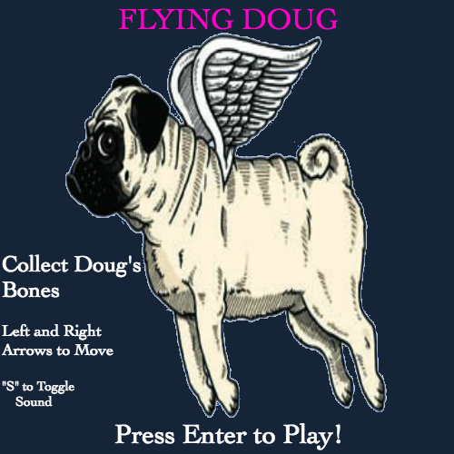

# Flying Doug

[live](https://harrisonbui.github.io/FlyingDoug/)

## Background
Flying Doug is a clone of [doodle jump](http://doodlejump.org/) written in javascript using Canvas. Sprites are used for game images.

Every time Doug the Pug lands on a platform, he is projected upward in hopes to reach a higher platform. The game is over when Doug misses a platform and decides skydiving.

## Controls/Scoring
- Use the left and right arrow keys to move the Doug.
- Blue platforms will project Doug at a normal distance.
- Pink platforms will allow the Doug to perform a super jump.
- The amount of bones Doug collects is the overall score.  

